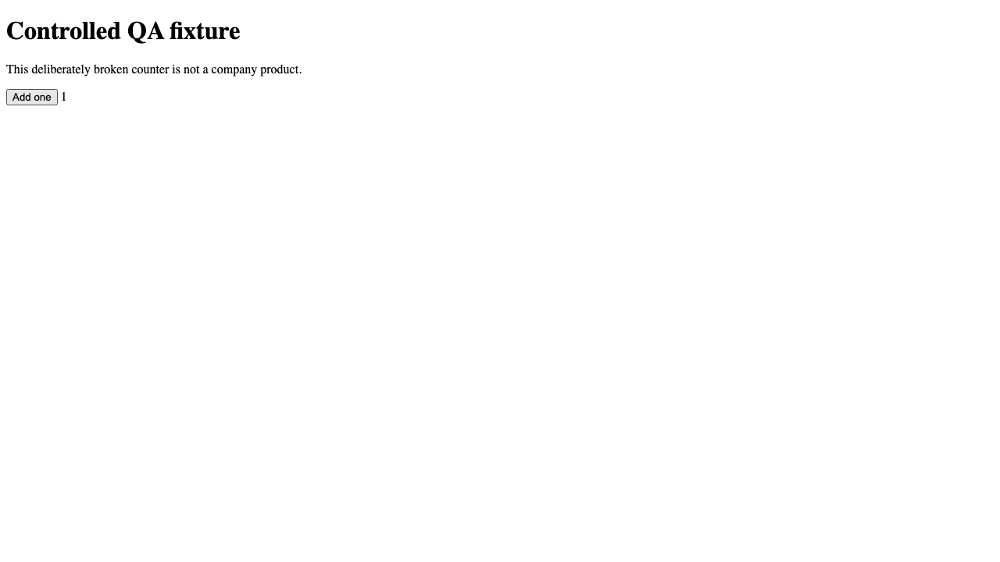

# Verified local fixture run

Executed September 10, 2026, on the SparkTech implementation worktree. This report describes actual subprocess and Chromium execution, not generated agent output.

Repair run: `20260910T222144-00aa10c4d0`. Outcome: `completed`, six subprocess commands, 33.312 seconds. Worker: `deterministic-fixture-repair`.

Follow-up run: `20260910T222218-78b7eb1126`. Outcome: `healthy`, one browser command, 2.432 seconds. No implementation worker ran during that follow-up.

| Stage | Actual evidence |
| --- | --- |
| Discover | Real Chromium clicked Add one; counter displayed `2`, expected `1`; exit 10 |
| Reproduce | Fresh Chromium context observed the same finding and fingerprint; exit 10 |
| Implement | Separate Python worker changed only isolated `index.html`: `count += 2` → `count += 1`; exit 0 |
| Test | Independent Node VM regression executed the actual script and verified five consecutive increments; exit 0 |
| Verify | Fresh Chromium context observed `1`; screenshot and trace captured; exit 0 |
| Local release | Company-local pointer switched to the verified snapshot; original source unchanged |
| Release check | Chromium tested the released snapshot and observed `1`; exit 0 |
| Next cycle | Read the integrity-checked released snapshot, observed `1`, returned healthy; exit 0 |

Candidate manifest digest: `78dea8c3c789aa613c417e97299bd092cb452b48d8fae8cffa87f7c0ee3437a1`.

Saved evidence is in [examples/verified-fixture](examples/verified-fixture). It includes exact status and transition records, command results, stdout/stderr, browser reports, screenshots, Playwright traces, diff and source/candidate manifests. `manifest.json` hashes the saved artifacts. Absolute paths inside original command records identify the execution environment; copied evidence remains reviewable after that worktree is removed.

Before repair:


After release:



Reproduce with `python3 demo.py`, after configuring the browser installation in the README. The script asserts observed values, artifact existence, successful release, healthy follow-up, and unchanged source. This desktop used:

```sh
RSEI_PLAYWRIGHT_MODULE=/Users/shoberman/.cache/codex-runtimes/codex-primary-runtime/dependencies/node/node_modules/playwright/index.js \
PLAYWRIGHT_BROWSERS_PATH=/Users/shoberman/Library/Caches/ms-playwright \
python3 demo.py
```

An initial attempt was recorded as failed because the desktop sandbox blocked the local HTTP server with `listen EPERM`. Successful runs used approved execution with local sockets and Chromium. No implementation ran in response to that infrastructure failure.

## Automated checks

`python3 -m unittest discover -s tests -v` passed 19 tests. Tests use explicitly named subprocess test doubles for orchestration faults; they do not claim browser or model coverage. Coverage includes release permissions/flag, rollback, flaky findings, infrastructure failure, unauthorized changes, regression failure, output overflow, timeout, command budget, source drift, implementation permission, credential filtering/redaction, company-local lessons, locking, recovery, symlink rejection, configuration validation, next-cycle integrity, live status reads, and Codex CLI/missing-credential contracts.

The demonstration separately supplies real browser coverage. The optional Codex adapter's live model path was not run: the host had the CLI but no company-scoped `CODEX_API_KEY`. The adapter has no silent mock or deterministic fallback.

## Activation boundary

To demonstrate an actual AI repair next, provision a company-scoped credential in the execution environment, select the approved model/budget, and enable the disabled Codex fixture config. Do not send credentials in chat. External adopters also need approved source/QA scope and dedicated execution environments with provider spending controls. This local runner does not supply hostile-tenant isolation or a hard dollar cap.

Production deployment, live company integration, authenticated production QA, analytics experiments, content/social publishing and continuous scheduling are not activated. LEED and Ballot Watch remain intended adopters; UTern remains independent and unchanged. Marketing website files are untouched.
